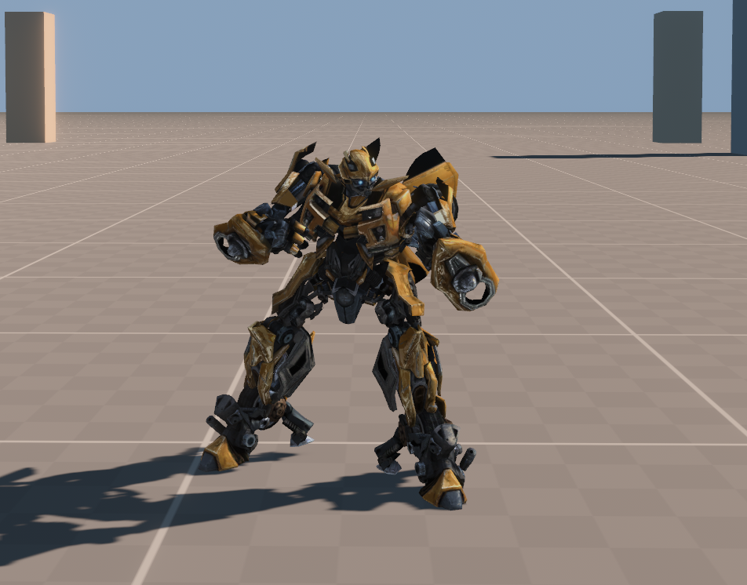

# Bumblebee rewrite

Created and maintained by [HUNK2](https://github.com/HUNK2).

Bumblebee's robot and vehicle mechanics from **Transformers: Revenge of the
Fallen (PC)**, reimplemented in Rust and Bevy with an authored arena and scouts.
This does not include the original campaign or levels.



**You must supply your own installed copy of the original PC game.** Models,
textures, animation, audio, UI and tuning are read from that install at runtime.
No original game media or packs are included or downloaded. The original game
executable is not launched and its folder is not modified. Console editions
cannot supply the PC data files.

## Development and controller testing

AI was used to assist with decompiling and analysing the original game's
executable and rewriting its mechanics in Rust and Bevy.

Mouse and keyboard input are supported, but this build was developed and tested
with an XInput controller.

The source now uses the original PC bindings for the implemented gameplay actions
and retains mouse movement between camera updates. See the updated control table
in the [player quickstart](docs/player-quickstart.md). The existing Windows ZIP
predates this source update; rebuild from source until a new ZIP is published.

## Windows download

Get the Windows x64 ZIP from this repository's Releases page. Extract it,
install the [Microsoft Visual C++ v14 x64 Redistributable](https://aka.ms/vc14/vc_redist.x64.exe)
if needed, and double-click `Start-Bumblebee.cmd`. Enter your original PC game
install folder on first launch. Rust is not required for this download.
The launcher remembers the folder locally. See the included README or the
[player quickstart](docs/player-quickstart.md) for controls and texture settings.

## Build and run on Windows x64

1. Install the original PC game. Locate the folder containing `bnxglobal.str`
   and `characters`. Keep the full install available.
2. Install [Rust with rustup](https://rust-lang.org/tools/install/) and the
   [Microsoft C++ build tools required on Windows](https://rust-lang.github.io/rustup/installation/windows.html).
   Use the MSVC toolchain; install Desktop development with C++ and a Windows SDK
   if prompted. Restart the terminal after installation.
3. Download and extract this repository or clone it. Open PowerShell in its root.
4. Run, replacing the sample path with your original game install:

```powershell
powershell -NoProfile -ExecutionPolicy Bypass -File .\play.ps1 -GameDirectory 'D:\Games\Transformers Revenge of the Fallen'
```

The launcher checks the main packs, sets TF2_GAME_DIR, then builds and runs the
rewrite. The first build downloads Rust dependencies and compiles Bevy; allow
several minutes. Python and Ghidra are not required. The rewrite does not require
administrator privileges.

Add `-Check` to inspect the character pack without opening a game window. This
diagnostic does not validate every asset used during gameplay.

For direct Cargo usage:

```powershell
$env:TF2_GAME_DIR = 'D:\Games\Transformers Revenge of the Fallen'
cargo run --locked -p bumblebee -- --original-textures
```

TF2_GAME_DIR is mandatory for direct launches. Point it at the game install,
not this repository or an executable. Missing/invalid data stops startup.

The launcher preserves the rewrite's 4x texture default. Add `-TextureScale 1`
for originals or `-TextureScale 2` to reduce memory use. Generated textures stay
in your local application cache and must not be redistributed. The 4x character
maps alone consume about 422 MiB including mip levels.

See [controls](game/README.md) and the [release audit](docs/release-audit.md).
The supported Windows/GPU/install-version matrix is still being validated.
Some developer tests assume a fixed install path; they are not required to play.

## Distribution boundary

Included: Rust source, authored shaders, configuration, documentation and three
numeric simulation-observation fixtures for tests. Excluded: original images,
meshes, animation clips, audio, movies, packs and extracted media.
The rewrite code is [MIT licensed](LICENSE). This does not license original
game content. [Third-party notices](docs/third-party-notices.md) cover the
dependencies and bundled open-source font.

## Prepare a Windows release

Install the build prerequisites above and Python 3. Fetch the locked dependencies
with `cargo fetch --locked`, then run `scripts/build-release.ps1` followed by
`scripts/package-release.ps1`. The scripts default to separate sibling build
and artifact directories. The build remaps source/profile paths; the package
uses an explicit seven-file list and fixed archive timestamps. Repeat the
source/history and executable/ZIP privacy audits before every publication.
If dependencies change, regenerate and review their notices before packaging.

## Contributors

- [HUNK2](https://github.com/HUNK2) — project creator and maintainer.
